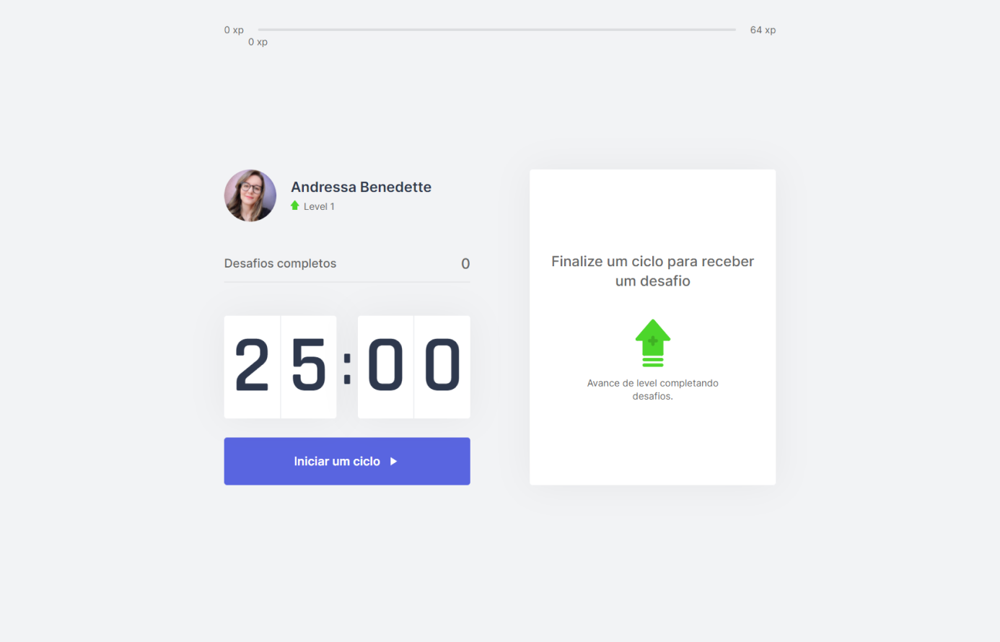

<p align="center">
   
   <br>
    NLW #04 - Move.it
</p>

## :computer: Projeto
Projeto desenvolvido para pessoas que ficam boa parte do dia em frente ao computador. Ele tem um contador de 25 minutos e a cada ciclo é gerado um exercício para o corpo ou para os olhos, ao concluir o exercício a pessoa ganha XP para subir de nível.<br> Projeto realizado na Next Level Week #4 pela Rocketseat.
<a href="https://moveit-one-tau.vercel.app/e">Veja aqui o projeto funcionando</a>

## :heart_eyes: Layout
Layout foi desenvolvido pelo Tiago Luchtenberg (@tiagoluchtenberg)<br>
<a href="https://www.figma.com/file/ge20pu3ofMOKoliUyKx1Nl/Move.it-1.0/duplicate">Clique aqui para ver o layout no Figma</a><br><br>


## :hammer: Tecnologias    
* [React](https://reactjs.org/)      
* [Next.js](https://nextjs.org/)    
* [Node.js](https://nodejs.org/en/)
* [Typescript](https://www.typescriptlang.org/)  

## :arrow_forward: Como rodar o projeto
```bash
# Clonar o repositório
$ git clone https://github.com/andressa-lw/moveit-nlw4.git

# Instalar as dependências
$ yarn install ou npm install

# Rodar aplicação
$ yarn dev ou npm run dev
```

## :rocket: Próximas features
* Tela de login com github
* Leaderboard
* Sidebar
* Compartilhar no twitter
* Darkmode

# :closed_book: License
This project is under the MIT license.
